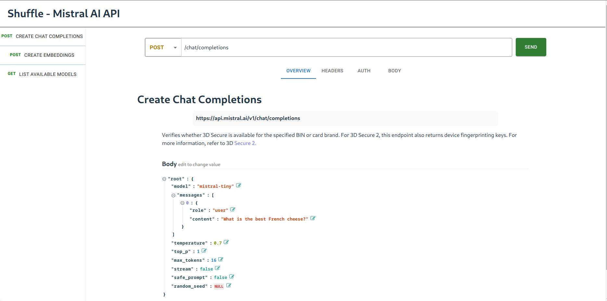
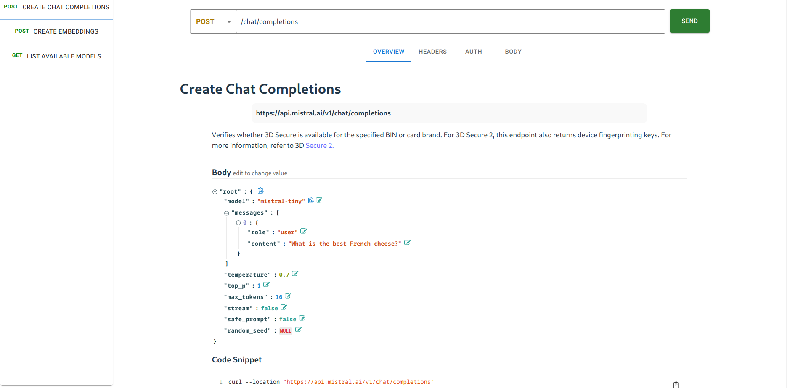

# API Explorer
API explorer NPM package

## Todos:

- [x] Parse OpenAPI version 3 data and visualize it
- [x] Categorize API paths as a left-side explorer~
- [x] Be an importable library to visualize and test API's. We will import it on the Shuffle side later.
- [ ] Let users choose API's from it and test them as normal HTTP commands

## Future todos:

- [ ] A middle-view focused on explaining the function you are testing
- [ ] Edit functionality to change the standard functionality of an API
- [ ] A Diff function, to make it possible to import & diff the current API and a new one.
- [ ] Other formats than OpenAPI3. This can be translated elsewhere and not on the frontend.

- More todos~
